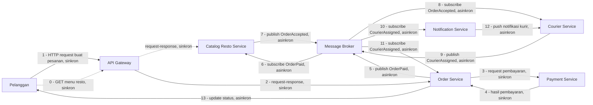

# Tugas 2 - Perancangan Arsitektur FoodGo

## Kelompok

| Nama                     | NIM          | Bagian yang dikerjakan               |
| ------------------------ | ------------ | ------------------------------------ |
| Yohana Sinaga            | 103072400009 | SOA dan Service                      |
| Yohanna Purnomo          | 103072400127 | Publish-Subscribe dan Message Broker |
| Laura Chyndearni Saragih | 103072400049 | Alur komunikasi dan trade-off        |

## 1. Gaya Arsitektur yang Dipilih

Kami memilih kombinasi **Service-Oriented Architecture (SOA)** dan **Publish-Subscribe (Pub-Sub)**.

Pelanggan perlu tahu seketika apakah pembayarannya berhasil sebelum pesanan dilanjutkan. Sifat komunikasinya membutuhkan jawaban yang pasti dan sinkron, sehingga bagian ini menggunakan **Service-Oriented Architecture (SOA)** dengan pola komunikasi *request-response*.

Resto perlu diberi tahu ketika ada pesanan baru, kurir perlu diberi tahu ketika ada tugas baru, dan pelanggan perlu mendapatkan informasi mengenai status kurir. Sifat komunikasi tersebut tidak selalu membutuhkan jawaban langsung, dapat memiliki beberapa penerima, dan boleh diproses sedikit tertunda. Oleh karena itu, bagian tersebut menggunakan **Publish-Subscribe (Pub-Sub)**.

Bagian transaksi inti, yaitu **Pesanan - Pembayaran**, tetap menggunakan pola SOA berbasis *request-response* karena keputusan "pembayaran berhasil atau gagal" harus diketahui sebelum sistem melanjutkan proses berikutnya. Jika proses tersebut dibuat sepenuhnya asinkron, sistem dapat melanjutkan proses pesanan sebelum mengetahui hasil pembayaran.

Sebaliknya, **koordinasi lintas layanan** seperti resto, kurir, dan notifikasi pelanggan menggunakan Pub-Sub melalui *message broker*. Dengan cara ini, Order Service tidak perlu mengetahui secara langsung siapa saja yang menerima event yang dikirimkannya Catalog Resto Service, Courier Service, dan Notification Service masing-masing berlangganan event yang relevan bagi mereka.

## 2. Komponen Sistem

Komponen yang digunakan dalam rancangan FoodGo:

1. API Gateway
2. Order Service / Service Pesanan
3. Payment Service / Service Pembayaran
4. Catalog Resto Service / Service Katalog Resto
5. Courier Service / Service Kurir
6. Notification Service / Service Notifikasi
7. Message Broker

### Fungsi masing-masing komponen

**API Gateway**

Menjadi pintu masuk permintaan dari pelanggan menuju service yang sesuai, termasuk permintaan membuat pesanan dan permintaan melihat menu restoo.

**Order Service**

Menangani pembuatan pesanan, memicu proses pembayaran, dan menyimpan/memperbarui status pesanan berdasarkan event yang diterimanya dari Message Broker.

**Payment Service**

Menangani proses pembayarann dan memberikan hasil pembayaran kepada Order Service secara langsung (sinkron).

**Catalog Resto Service**

Mengelola informasi restoran dan menu yang tersedia (diakses langsung lewat API Gateway), sekaligus menjadi penerima notifikasi pesanan baru dengan berlangganan event dari Message Broker setelah pesanan dibayar.

**Courier Service**

Menangani pencarian dan penugasan kurir. Service ini baru bertindak setelah resto mengonfirmasi menerima pesanan, bukan bersamaan dengan pembayaran selesai.

**Notification Service**

Mengirimkan informasi atau perubahan status kepada pihak yang membutuhkan, seperti kurir (tugas baru) dan pelanggan (status kurir).

**Message Broker**

Menjadi perantara untuk komunikasi berbasis event antar service yang menggunakan pola Publish-Subscribe, sehingga Order Service tidak perlu memanggil Catalog Resto Service, Courier Service, atau Notification Service secara langsung.

## Diagram Arsitektur

Keterangan:

- Panah putus-putus (`Customer --- Gateway --- Catalog`, langkah 0) adalah alur melihat menu, terpisah dari alur pemesanan di atas, dan tetap bersifat sinkron karena pelanggan menunggu daftar menu untuk ditampilkan.
- Langkah 1–4 (Pelanggan - Gateway - Order - Payment - Order) bersifat sinkron, request-response ini bagian SOA.
- Langkah 5–13, semuanya lewat Message Broker, bersifat asinkron, event-based — ini bagian Publish-Subscribe. Order Service, Catalog Resto Service, Courier Service, dan Notification Service tidak pernah memanggil satu sama lain secara langsung pada bagian ini.
- Urutan event (`OrderPaid` - `OrderAccepted` - `CourierAssigned`) memastikan kurir baru ditugaskan setelah resto menerima pesanan, bukan bersamaan dengan pembayaran selesai.

## 4. Alur End-to-End

### 4.1 Pelanggan membuat pesanan

Pelanggan akan mengirim permintaan pembuatan pesanan dari API Gateway. API Gateway kemuadian mengirimkam permintaan tersebut kepada Order Service.

**Jenis komunikasi:** Sinkron / request-response.

### 4.2 Order memproses pembayaran

Order Service meminta Payment Service supaya memproses pembayaran. Lalu Payment Service memberikan hasil apakah pembayaran berhasil atau gagal dan Order Service akan menunggu jawaban ini sebelum melanjutkan.

**Jenis komunikasi:** Sinkron / request-response.

Bagian ini memakai komunikasi sinkron karena Order Service membutuhkan hasil pembayaran sebelum melanjutkan proses pesanan. Jika pe,bayaran nya gagal, alur berhenti di sini dan tidak ada event yang dikirim ke Message Broker.

### 4.3 Resto menerima notifikasi pesanan

Setelah pembayaran berhasil, Order Service mem-*publish* event `OrderPaid` ke Message Broker. Catalog Resto Service berlangganan event ini lalu menerima pemberitahuan pesanan baru **tanpa dipanggil langsung oleh Order Service**. Setelah resto menekan "terima pesanan", Catalog Resto Service mem-*publish* event `OrderAccepted`.

**Jenis komunikasi:** Asinkron / Publish-Subscribe.

### 4.4 Kurir ditugaskan

Courier Service berlangganan event `OrderAccepted` —yang artinya Courier Service baru memulai mencari dan menugaskan kurir **setelah** resto mengonfirmasi pesanan, bukan bersamaan dengan pembayaran. Setelah kurir ditentukan, Courier Service mem-*publish* event `CourierAssigned`.

**Jenis komunikasi:** Asinkron / Publish-Subscribe.

### 4.5 Kurir dan pelanggan menerima notifikasi

Notification Service dan Order Service sama sama berlangganan event `CourierAssigned`. Notification Service mengirim notifikasi tugas ke aplikasi kurir, sedangkan Order Service memperbarui status pesanan dan mendorong perubahan tersebut ke pelanggan.

**Jenis komunikasi:** Asinkron / Publish-Subscribe.

---

## 5. Jenis Komunikasi

| Komunikasi                                      | Event / Data       | Jenis    | Alasan                                                                           |
| ------------------------------------------------ | ------------------- | -------- | --------------------------------------------------------------------------------- |
| Pelanggan → API Gateway → Catalog Resto Service | GET menu            | Sinkron  | Pelanggan menunggu daftar menu untuk ditampilkan                                  |
| Pelanggan → API Gateway → Order Service         | Buat pesanan         | Sinkron  | Pelanggan membutuhkan konfirmasi bahwa pesanan diterima sistem                    |
| Order Service → Payment Service                 | Permintaan bayar     | Sinkron  | Order perlu memastikan pembayaran berhasil sebelum melanjutkan                    |
| Payment Service → Order Service                 | Hasil bayar          | Sinkron  | Hasil pembayaran harus segera diketahui, bukan ditunda                            |
| Order Service → Message Broker                  | `OrderPaid`          | Asinkron | Order tidak perlu tahu siapa saja yang akan memproses pesanan yang sudah dibayar  |
| Message Broker → Catalog Resto Service          | `OrderPaid`          | Asinkron | Notifikasi resto boleh diproses sedikit tertunda                                  |
| Catalog Resto Service → Message Broker          | `OrderAccepted`      | Asinkron | Konfirmasi resto diteruskan tanpa Catalog memanggil Courier secara langsung       |
| Message Broker → Courier Service                | `OrderAccepted`      | Asinkron | Penugasan kurir baru berjalan setelah resto menerima pesanan                       |
| Courier Service → Message Broker                | `CourierAssigned`    | Asinkron | Hasil penugasan kurir perlu disebarkan ke lebih dari satu penerima                 |
| Message Broker → Notification Service, Order    | `CourierAssigned`    | Asinkron | Notifikasi kurir dan update status pelanggan dapat diproses paralel               |

---

## 6. Alasan Kombinasi SOA dan Publish-Subscribe

Kombinasi digunakan karena tidak semua komunikasi dalam FoodGo memiliki kebutuhan yg sama.

Komunikasi antara Order Service dan Payment Service membutuhkan hasil secara langsung sehingga lebih sesuai menggunakan komunikasi sinkron (SOA). Di sisi lain, informasi seperti pesanan baru, konfirmasi resto, dan tugas kurir akan dikirim melalui event (Pub-Sub) karena dapat diprose beberapa service dengan cara terpisah dan tidak membutuhkan jawaban seketika.

Dengan SOA, fungsi utama FoodGo dipisahkan menjadi beberapa service yang jelas batasnya (Order, Payment, Catalog). Dengan Pub-Sub, service yang menghasilkan event — dalam hal ini Order Service dan Catalog Resto Service — tidak perlu mengetahui secara langsung seluruh service yang menerima event tersebut. Catalog Resto Service kini menjadi bagian dari alur notifikasi lewat broker (bukan hanya diakses lewat API Gateway untuk menu), sehingga urutan "resto menerima notifikasi → baru kurir ditugaskan" bisa dijamin lewat urutan event `OrderPaid` → `OrderAccepted` → `CourierAssigned`, bukan hanya kebetulan proses paralel.

Hal ini mengurangi ketergantungan langsung antar service dibandingkan jika setiap service harus memanggil service lain secara langsung — sesuai kebutuhan *decoupling* dari Tugas 1, di mana tim kurir dan tim resto sebelumnya harus ikut terdampak setiap kali ada deploy ulang pada modul lain.

---

## 7. Trade-off

### Trade-off SOA

Pemisahan service membuat setiap bagian sistem lebih terpisah, tetapi komunikasi Order Service–Payment Service sekarang bergantung pada jaringan dan bersifat sinkron. Jika Payment Service lambat merespons/sedang down, pembuatan pesanan ikut tertaha/ gagal total. Ini perlu ditangani dengan *timeout*, mekanisme *retry* terbatas, dan *circuit breaker* di sisi Order Service agar kegagalan Payment Service tidak membuat seluruh Order Service ikut macet.

### Trade-off Publish-Subscribe

Publish-Subscribe mengurangi ketergantungan langsung antara publisher dan subscriber tetapi alur sistem menjadi lebih sulit dilacak karena tidak berjalan dalam satu jalur linear. Ketika sebuah event tidak sampai atau tidak diproses, tim perlu memeriksa tiga kemungkinan sumber masalah yaitu publisher, message broker, atau subscriber — yg masing-masing dikelola tim berbeda.

### Penanganan trade-off tambahan

- **Event gagal diproses:** ditangani dengan mekanisme *retry* otomatis oleh broker, dan bila tetap gagal setelah beberapa percobaan, event dipindahkan ke *dead-letter queue* untuk diperiksa manual, bukan hilang begitu saja.
- **Event terlambat:** setiap event diberi *timestamp* dan batas waktu wajar (mis. penugasan kurir yang belum diproses setelah beberapa menit ditandai untuk ditinjau ulang), sehingga keterlambatan tidak terjadi tanpa terdeteksi.
- **Event diterima lebih dari satu kali:** setiap event diberi ID unik dan setiap subscriber (Catalog Resto Service, Courier Service, Notification Service) dibuat *idempotent* — memproses event dengan ID yang sama dua kali tidak boleh menghasilkan efek ganda, misalnya menugaskan dua kurir untuk satu pesanan.
- **Monitoring antarservice:** setiap pesanan diberi *correlation ID* yang disertakan di setiap event (`OrderPaid`, `OrderAccepted`, `CourierAssigned`), sehingga status satu pesanan bisa ditelusuri lintas service dari satu ID yang sama.
- **Debugging saat kegagalan:** dengan *correlation ID* dan pencatatan log di setiap service serta di broker, tim dapat menelusuri di titik mana sebuah pesanan berhenti diproses, tanpa harus menebak nebak dari log yang terpisah pisah.

---

## 8. Kesimpulan

FoodGo membutuhkan arsitektur yang lebih terpisah dibandingkan arsitektur monolitik sebelumnya. Kombinasi SOA dan Publish-Subscribe digunakan karena kedua pendekatan tersebut memiliki fungsi yang berbeda.

SOA digunakan untuk bagian yang membutuhkan kepastian langsung, yaitu pesanan dan pembayaran. Publish-Subscribe digunakan untuk menyebarkan event kepada service yang membutuhkan Catalog Resto Service, Courier Service, dan Notification Service tanpa membuat Order Service bergantung langsung kepada semua penerima, dan dengan urutan event yang menjamin resto menerima notifikasi terlebih dahulu sebelum kurir ditugaskan.

Dengan rancangan tersebut, perubahan atau deployment pada satu service (misalnya Courier Service atau Notification Service) tidak lagi menyebabkan seluruh aplikasi FoodGo ikut berhenti. Namun, pemisahan service dan penggunaan message broker juga menambah kompleksitas: kegagalan, keterlambatan, dan duplikasi event perlu ditangani secara eksplisit, dan proses debugging membutuhkan bantuan *correlation ID* karena alurnya tidak lagi berjalan dalam satu proses tunggal seperti sebelumnya.
