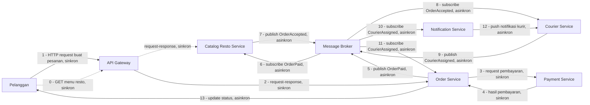

# Tugas 2 - Perancangan Arsitektur FoodGo

## Kelompok

| Nama                     | NIM          | Bagian yang dikerjakan               |
| ------------------------ | ------------ | ------------------------------------ |
| Yohana Sinaga            | 103072400009 | SOA dan Service                      |
| Yohanna Purnomo          | 103072400127 | Publish-Subscribe dan Message Broker |
| Laura Chyndearni Saragih | 103072400049 | Alur komunikasi dan trade-off        |

## 1. Gaya Arsitektur yang Dipilih

Kami memilih kombinasi **Service-Oriented Architecture (SOA)** dan **Publish-Subscribe (Pub-Sub)**.

Pelanggan perlu tahu seketika apakah pembayarannya berhasil sebelum pesanan dilanjutkan. Sifat komunikasinya membutuhkan jawaban yang pasti dan sinkron, sehingga bagian ini menggunakan **Service-Oriented Architecture (SOA)** dengan pola komunikasi *request-response*.

Resto perlu diberi tahu ketika ada pesanan baru, kurir perlu diberi tahu ketika ada tugas baru, dan pelanggan perlu mendapatkan informasi mengenai status kurir. Sifat komunikasi tersebut tidak selalu membutuhkan jawaban langsung, dapat memiliki beberapa penerima, dan boleh diproses sedikit tertunda. Oleh karena itu, bagian tersebut menggunakan **Publish-Subscribe (Pub-Sub)**.

Bagian transaksi inti, yaitu **Pesanan - Pembayaran**, tetap menggunakan pola SOA berbasis *request-response* karena keputusan "pembayaran berhasil atau gagal" harus diketahui sebelum sistem melanjutkan proses berikutnya. Jika proses tersebut dibuat sepenuhnya asinkron, sistem dapat melanjutkan proses pesanan sebelum mengetahui hasil pembayaran.

Sebaliknya, **koordinasi lintas layanan** seperti resto, kurir, dan notifikasi pelanggan menggunakan Pub-Sub melalui *message broker*. Dengan cara ini, Order Service tidak perlu mengetahui secara langsung siapa saja yang menerima event yang dikirimkannya Catalog Resto Service, Courier Service, dan Notification Service masing-masing berlangganan event yang relevan bagi mereka.

## 2. Komponen Sistem

Komponen yang digunakan dalam rancangan FoodGo:

1. API Gateway
2. Order Service / Service Pesanan
3. Payment Service / Service Pembayaran
4. Catalog Resto Service / Service Katalog Resto
5. Courier Service / Service Kurir
6. Notification Service / Service Notifikasi
7. Message Broker

### Fungsi masing-masing komponen

**API Gateway**

Menjadi pintu masuk permintaan dari pelanggan menuju service yang sesuai, termasuk permintaan membuat pesanan dan permintaan melihat menu restoo.

**Order Service**

Menangani pembuatan pesanan, memicu proses pembayaran, dan menyimpan/memperbarui status pesanan berdasarkan event yang diterimanya dari Message Broker.

**Payment Service**

Menangani proses pembayarann dan memberikan hasil pembayaran kepada Order Service secara langsung (sinkron).

**Catalog Resto Service**

Mengelola informasi restoran dan menu yang tersedia (diakses langsung lewat API Gateway), sekaligus menjadi penerima notifikasi pesanan baru dengan berlangganan event dari Message Broker setelah pesanan dibayar.

**Courier Service**

Menangani pencarian dan penugasan kurir. Service ini baru bertindak setelah resto mengonfirmasi menerima pesanan, bukan bersamaan dengan pembayaran selesai.

**Notification Service**

Mengirimkan informasi atau perubahan status kepada pihak yang membutuhkan, seperti kurir (tugas baru) dan pelanggan (status kurir).

**Message Broker**

Menjadi perantara untuk komunikasi berbasis event antar service yang menggunakan pola Publish-Subscribe, sehingga Order Service tidak perlu memanggil Catalog Resto Service, Courier Service, atau Notification Service secara langsung.

## Diagram Arsitektur

Keterangan:

- Panah putus-putus (`Customer --- Gateway --- Catalog`, langkah 0) adalah alur melihat menu, terpisah dari alur pemesanan di atas, dan tetap bersifat sinkron karena pelanggan menunggu daftar menu untuk ditampilkan.
- Langkah 1–4 (Pelanggan - Gateway - Order - Payment - Order) bersifat sinkron, request-response ini bagian SOA.
- Langkah 5–13, semuanya lewat Message Broker, bersifat asinkron, event-based — ini bagian Publish-Subscribe. Order Service, Catalog Resto Service, Courier Service, dan Notification Service tidak pernah memanggil satu sama lain secara langsung pada bagian ini.
- Urutan event (`OrderPaid` - `OrderAccepted` - `CourierAssigned`) memastikan kurir baru ditugaskan setelah resto menerima pesanan, bukan bersamaan dengan pembayaran selesai.

## 8. Kesimpulan

FoodGo membutuhkan arsitektur yang lebih terpisah dibandingkan arsitektur monolitik sebelumnya. Kombinasi SOA dan Publish-Subscribe digunakan karena kedua pendekatan tersebut memiliki fungsi yang berbeda.

SOA digunakan untuk bagian yang membutuhkan kepastian langsung, yaitu pesanan dan pembayaran. Publish-Subscribe digunakan untuk menyebarkan event kepada service yang membutuhkan Catalog Resto Service, Courier Service, dan Notification Service tanpa membuat Order Service bergantung langsung kepada semua penerima, dan dengan urutan event yang menjamin resto menerima notifikasi terlebih dahulu sebelum kurir ditugaskan.

Dengan rancangan tersebut, perubahan atau deployment pada satu service (misalnya Courier Service atau Notification Service) tidak lagi menyebabkan seluruh aplikasi FoodGo ikut berhenti. Namun, pemisahan service dan penggunaan message broker juga menambah kompleksitas: kegagalan, keterlambatan, dan duplikasi event perlu ditangani secara eksplisit, dan proses debugging membutuhkan bantuan *correlation ID* karena alurnya tidak lagi berjalan dalam satu proses tunggal seperti sebelumnya.
